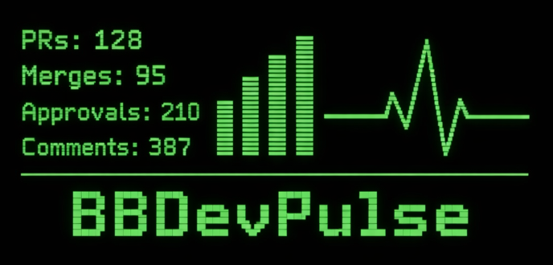

# BBDevPulse


BBDevPulse is a console analytics utility for tracking Bitbucket pull request activity.
It helps you see PR throughput, review load, merge speed, and per-developer contribution.

## How the service works
1. Loads configuration from `appsettings.json` (`Bitbucket` section).
2. Authenticates against Bitbucket Cloud API using basic auth (`Username` + `AppPassword`).
3. Fetches repositories from the configured workspace with pagination (`PageLength`).
4. Filters repositories using `RepoSearchMode`:
   - `SearchByFilter` -> uses `RepoNameFilter` substring match (name or slug).
   - `FilterFromTheList` -> uses exact matches from `RepoNameList` (name or slug).
5. Fetches pull requests for each selected repo (open, merged, declined, superseded), sorted by latest updates.
6. Applies PR time-stop mode (`PrTimeFilterMode`) to stop reading older PR pages earlier.
7. Fetches PR activity (comments/approvals/updates), aggregates participation and timing stats.
8. Renders output tables:
   - Repositories included in analysis
   - Pull request report
   - Merge-time statistics (best/median/75p/longest)
   - Developer statistics (PRs opened, merged, comments, approvals)

## appsettings.json parameters
All settings are under the `Bitbucket` object.

- `Days` (`int`): Number of days to look back from now. Used to build `filterDate = UtcNow - Days`.
- `Workspace` (`string`): Bitbucket workspace slug/name to scan repositories from.
- `PageLength` (`int`): API page size for repository/PR/activity requests.
- `Username` (`string`): Bitbucket account username/email used for authentication.
- `AppPassword` (`string`): Bitbucket app password used for authentication.
- `RepoSearchMode` (`string` enum):
  - `SearchByFilter`
  - `FilterFromTheList`
- `PrTimeFilterMode` (`string` enum):
  - `LastKnownUpdateAndCreated` (default behavior): stop PR paging when both
    `lastKnownUpdate` and `createdOn` are older than `filterDate`.
  - `CreatedOnOnly`: stop PR paging when `createdOn` is older than `filterDate`.
- `RepoNameFilter` (`string`): Substring filter used when `RepoSearchMode = SearchByFilter`.
- `RepoNameList` (`string[]`): Explicit repo names/slugs used when `RepoSearchMode = FilterFromTheList`.
- `BranchNameList` (`string[]`): Target branch names to include in PR analysis (e.g., `develop`, `master`).

## Example configuration
```json
{
  "Bitbucket": {
    "Days": 30,
    "Workspace": "your-workspace",
    "PageLength": 50,
    "Username": "your-email@company.com",
    "AppPassword": "your-app-password",
    "RepoSearchMode": "FilterFromTheList",
    "PrTimeFilterMode": "LastKnownUpdateAndCreated",
    "RepoNameFilter": "ABC.",
    "RepoNameList": [
      "Service.A",
      "Service.B"
    ],
    "BranchNameList": [
      "develop"
    ]
  }
}
```
