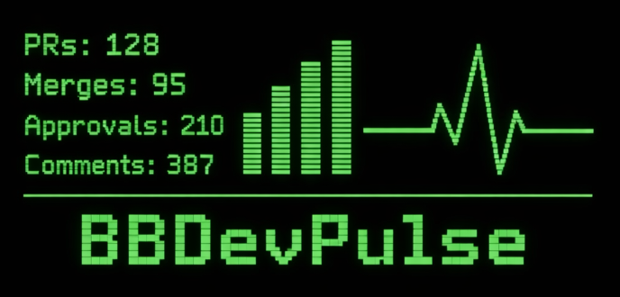
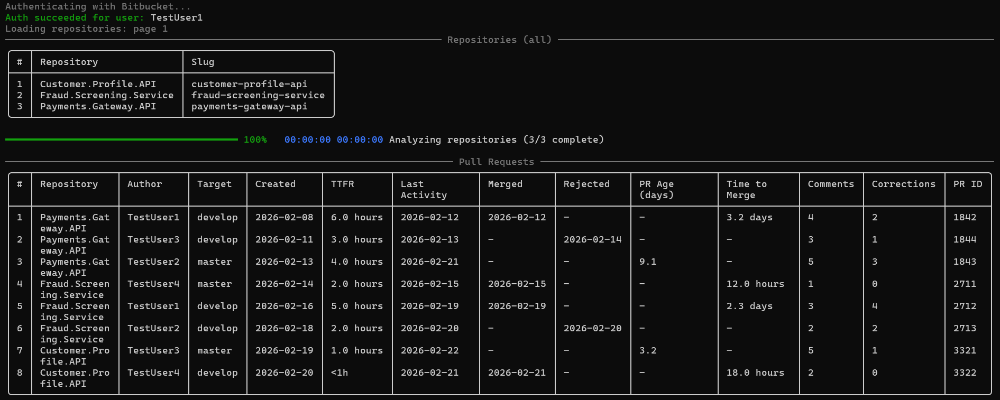
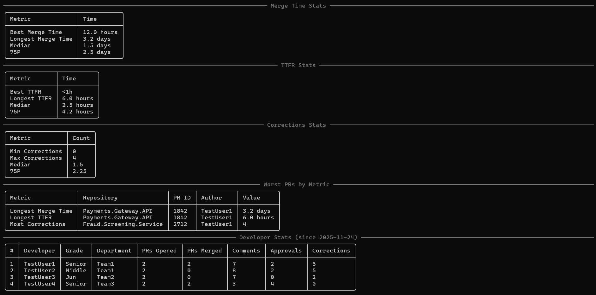
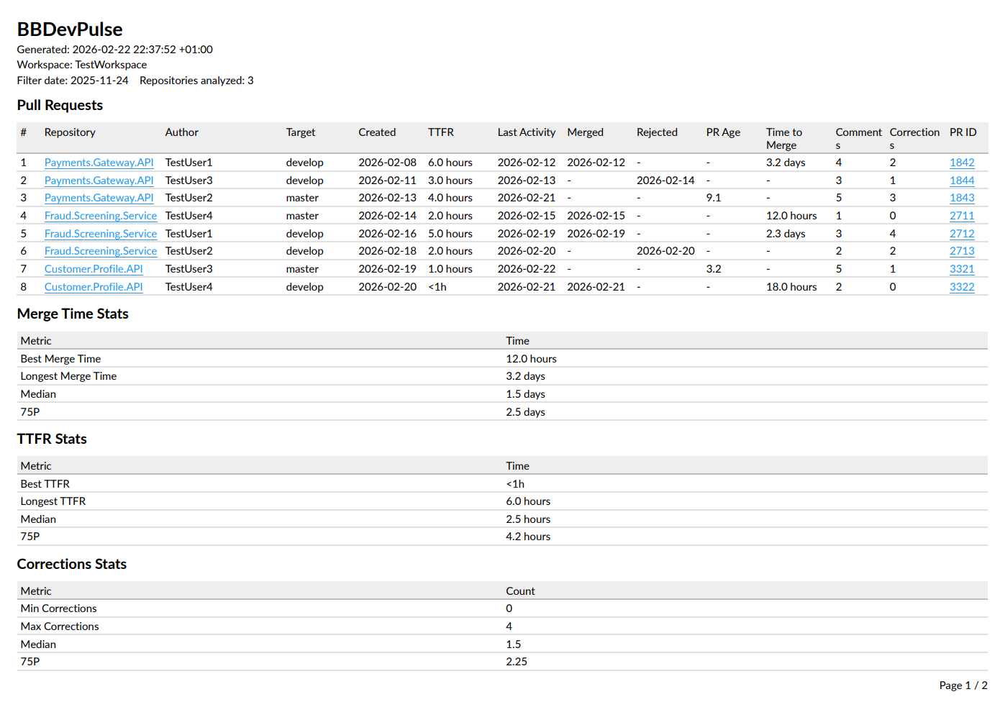
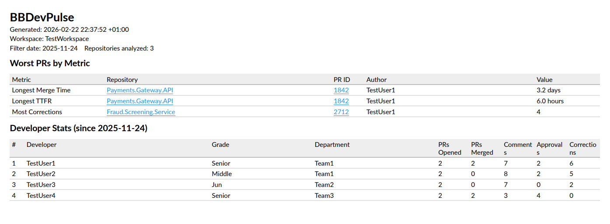

# BBDevPulse


BBDevPulse is a console analytics utility for tracking Bitbucket pull request activity.
It helps you see PR throughput, review load, merge speed, and per-developer contribution.

## How the service works
1. Loads configuration from `appsettings.json` (`Bitbucket` section).
2. Authenticates against Bitbucket Cloud API using basic auth (`Username` + `AppPassword`).
3. Fetches repositories from the configured workspace with pagination (`PageLength`).
4. Filters repositories using `RepoSearchMode`:
   - `SearchByFilter` -> uses `RepoNameFilter` substring match (name or slug).
   - `FilterFromTheList` -> uses exact matches from `RepoNameList` (name or slug).
5. Fetches pull requests for each selected repo (open, merged, declined, superseded), sorted by latest updates.
6. Applies PR time-stop mode (`PrTimeFilterMode`) to stop reading older PR pages earlier.
7. Fetches PR activity (comments/approvals/updates) and PR diffstat size (added/removed lines), then aggregates participation and timing stats.
8. Renders output tables:
   - Repositories included in analysis
   - Pull request report (includes `Size` T-shirt metric)
   - Merge-time statistics (best/median/75p/longest)
   - PR size statistics (smallest/biggest/median/75p by selected size mode)
   - Developer statistics (grade, department, PRs opened, merged, comments, approvals, corrections)
   - Worst PRs by metric (longest merge, longest TTFR, most corrections, biggest PR)
9. Optionally generates a PDF report using QuestPDF (`Bitbucket:Pdf` settings).

When `TeamFilter` is configured:
- All matching repositories and pull requests are still analyzed for activity.
- PR rows include pull requests whose author belongs to the selected team, plus PRs authored outside the team when the selected team had activity on them.
- External-author PRs shown because of team activity are highlighted in orange in console/PDF output.
- PR-based metrics still include only pull requests whose author belongs to the selected team.
- Developer output includes only developers from the selected team.
- Team members still get comment/approval activity counted even on PRs authored by people outside the team.

## PR Size calculation
PR size is based on Bitbucket `diffstat` between pull request source and destination commits.
The metric used for T-shirt sizing is controlled by `PullRequestSizeMode`.

For each PR:
- Resolve `source` and `destination` commit hashes from PR details.
- Request diffstat for commit range:
  - `repositories/{workspace}/{repo}/diffstat/{workspace}/{repo}:{sourceHash}..{destinationHash}?topic=true`
- Aggregate values:
  - `linesAdded` = sum of `lines_added`
  - `linesRemoved` = sum of `lines_removed`
  - `lineChurn` = `linesAdded + linesRemoved`

### `PullRequestSizeMode = Lines` (default)
T-shirt size (`Size`) is derived from `lineChurn`:
- `XS` -> `<= 100`
- `S` -> `101..300`
- `M` -> `301..700`
- `L` -> `701..1200`
- `XL` -> `> 1200`

### `PullRequestSizeMode = Files`
T-shirt size (`Size`) is derived from `filesChanged`:
- `XS` -> `<= 2`
- `S` -> `3..5`
- `M` -> `6..10`
- `L` -> `11..20`
- `XL` -> `> 20`

Where size is shown:
- Pull Requests table: `Size` column in format `Tier (value)` where value is `lineChurn` (Lines mode) or `filesChanged` (Files mode).
- PR Size Stats section:
  - `Smallest PR` = minimum value for selected mode
  - `Biggest PR` = maximum value for selected mode
  - `Median` = 50th percentile value for selected mode
  - `75P` = 75th percentile value for selected mode
- Worst PRs by Metric: `Biggest PR` is the PR with highest value for selected mode (distinct selection from other worst metrics).

If diffstat cannot be read for a PR (API error, missing commit hashes), size is treated as unavailable for that PR and excluded from PR-size aggregates.

## appsettings.json parameters
All settings are under the `Bitbucket` object.

- `Days` (`int`): Number of days to look back from now. Used to build `filterDate = UtcNow - Days`.
- `Workspace` (`string`): Bitbucket workspace slug/name to scan repositories from.
- `PageLength` (`int`): API page size for repository/PR/activity requests.
- `PullRequestConcurrency` (`int`): Maximum number of pull requests analyzed in parallel per repository.
- `RepositoryConcurrency` (`int`): Maximum number of repositories analyzed in parallel.
- `Username` (`string`): Bitbucket account username/email used for authentication.
- `AppPassword` (`string`): Bitbucket app password used for authentication.
- `RepoSearchMode` (`string` enum):
  - `SearchByFilter`
  - `FilterFromTheList`
- `PrTimeFilterMode` (`string` enum):
  - `LastKnownUpdateAndCreated` (default behavior): stop PR paging when both
    `lastKnownUpdate` and `createdOn` are older than `filterDate`.
  - `CreatedOnOnly`: stop PR paging when `createdOn` is older than `filterDate`.
- `PullRequestSizeMode` (`string` enum):
  - `Lines` (default): PR size metric is `lineChurn = linesAdded + linesRemoved`.
  - `Files`: PR size metric is number of changed files.
- `ExcludeWeekend` (`bool`): Excludes Saturdays and Sundays from time-based metrics (TTFR, time-to-merge, open PR age).
- `ExcludedDays` (`string[]`): Optional explicit holidays/non-working days excluded from time-based metrics.
  Supports `dd.MM.yyyy` and `yyyy-MM-dd` formats.
- `PeopleCsvPath` (`string`): Optional path to a CSV file with developer metadata in format `Name;Grade;Department`.
  Name matching is exact against developer display names in report stats. Missing matches stay `N/A`.
- `TeamFilter` (`string`): Optional team name resolved from the `Department` column in `PeopleCsvPath`. When set, PR rows, PR metrics, and developer output are limited to that team, while team member review activity on other authors' PRs is still counted.
- `RepoNameFilter` (`string`): Substring filter used when `RepoSearchMode = SearchByFilter`.
- `RepoNameList` (`string[]`): Explicit repo names/slugs used when `RepoSearchMode = FilterFromTheList`.
- `BranchNameList` (`string[]`): Target branch names to include in PR analysis (e.g., `develop`, `master`).
- `Pdf.Enabled` (`bool`): Enables/disables PDF generation after console output is rendered.
- `Pdf.OutputPath` (`string`): Output file path for the PDF. A date suffix (`dd_MM_yyyy`) is appended automatically.

## Example configuration
```json
{
  "Bitbucket": {
    "Days": 30,
    "Workspace": "your-workspace",
    "PageLength": 50,
    "PullRequestConcurrency": 4,
    "RepositoryConcurrency": 4,
    "Username": "your-email@company.com",
    "AppPassword": "your-app-password",
    "RepoSearchMode": "FilterFromTheList",
    "PrTimeFilterMode": "LastKnownUpdateAndCreated",
    "PullRequestSizeMode": "Lines",
    "ExcludeWeekend": false,
    "ExcludedDays": [
      "01.01.2026",
      "2026-01-02"
    ],
    "PeopleCsvPath": "people.csv",
    "TeamFilter": "",
    "RepoNameFilter": "ABC.",
    "RepoNameList": [
      "Service.A",
      "Service.B"
    ],
    "BranchNameList": [
      "develop"
    ],
    "Pdf": {
      "Enabled": true,
      "OutputPath": "bbdevpulse-report.pdf"
    }
  }
}
```

Example `people.csv`:
```text
Name;Grade;Department
Alice Doe;Senior;Core
Bob Smith;Middle;Import
```
## Output

>For demonstration purposes, the program output shown in the screenshots uses synthetic data to avoid exposing information from real repositories and users.

### Console



### PDF


